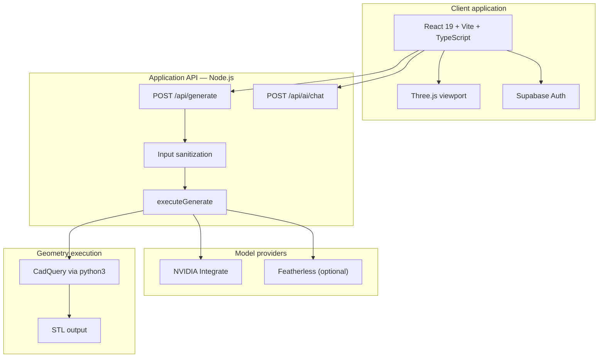

<div align="center">

# MechaGen

**Generative mechanical design in the browser**

Natural language and optional vision → validated geometry → interactive 3D preview → **STL · OBJ · GLB** export, with an engineering co-pilot and Supabase-backed authentication.

[](LICENSE)
[](https://nodejs.org/)
[](https://react.dev/)

</div>

---

## Executive summary

- **Problem:** Early mechanical concepts are slow to turn into inspectable 3D geometry; traditional CAD has a steep learning curve for ideation and iteration.
- **Solution:** MechaGen couples a **frontier LLM** (NVIDIA Integrate–compatible API, with optional Featherless fallback) to two geometry backends: **fast procedural JSON** for instant preview, and **CadQuery (Python)** for solid-model **STL** output when full fidelity is required.
- **Product fit:** The stack is split into a **SPA + API** suitable for **SaaS**: auth, stateless HTTP APIs, clear env-based configuration, and a documented path to split **serverless Node** from **Python workers** in production.

---

## Table of contents

1. [Capabilities](#capabilities)
2. [System architecture](#system-architecture)
3. [Generation pipeline](#generation-pipeline)
4. [Repository structure](#repository-structure)
5. [Requirements](#requirements)
6. [Configuration](#configuration)
7. [Local development](#local-development)
8. [Deployment](#deployment)
9. [HTTP API](#http-api)
10. [Operations & security](#operations--security)
11. [Scripts](#scripts)
12. [License](#license)

---

## Capabilities

| Area | Detail |
|------|--------|
| **Input** | Text prompt, optional **reference image** (base64), optional **context** and **project name** for constraints and naming. |
| **Geometry** | **Procedural mode:** LLM emits structured `parts[]` (shapes, transforms, materials) — rendered in-app without a Python runtime on that path. **CAD mode:** LLM emits **CadQuery** Python; `runner.py` produces **STL** (base64 in API response). |
| **Visualization** | **Three.js** viewport: materials, lighting, wireframe, opacity; mesh export to common formats. |
| **Copilot** | `POST /api/ai/chat` — same AI configuration as generation, scoped to conversational assistance. |
| **Identity** | **Supabase Auth** for sign-in / registration and session management. |
| **Collaboration (optional)** | If `VITE_WS_URL` is configured, the client may use **WebSockets** for realtime-style updates; core flows do not depend on it. |

---

## System architecture



**Technology choices**

| Layer | Stack |
|-------|--------|
| UI | React 19, TypeScript, Vite |
| 3D | Three.js |
| API | Node.js ≥ 18, Vercel-style handlers under `backend/api/` |
| AI | OpenAI-compatible chat completions (primary: NVIDIA; optional Featherless) |
| Solid modeling | CadQuery, subprocess invocation from Node |

---

## Generation pipeline

1. **Request:** Client sends JSON to `POST /api/generate` (`prompt` and/or `image`, plus flags such as `highDetail`, `proceduralParts`, `context`, `projectName`).
2. **Validation:** `backend/lib/sanitize.js` enforces length limits, image prefix allowlists, and boolean types.
3. **Prompt assembly:** `backend/lib/executeGenerate.js` merges user fields; `backend/lib/ai.js` applies system prompts (including mode-specific instructions and, where relevant, gear/bearing constraints).
4. **Branch:**
   - **`proceduralParts: true`:** Model returns JSON with `parts` → response includes structured geometry for the client renderer (default UI path).
   - **`proceduralParts: false`:** Model returns CadQuery source → `backend/python/runner.py` executes under a configurable timeout → response includes **base64 STL** and source `code`.
5. **Presentation:** The client loads meshes or procedural parts into the viewport and exposes export actions.

**`highDetail`:** Extends timeouts and strengthens prompting for finer mechanical detail (e.g. threads, chamfers). Complex classes such as gears and bearings receive additional prompt guardrails in `lib/ai.js`.

---

## Repository structure

```
mechagen/
├── frontend/                 # SPA
│   ├── src/                  # UI, viewport, panels, auth flow
│   ├── vite.config.js
│   └── vite-api-plugin.js    # Dev: in-process mounting of backend handlers + /api/*
├── backend/
│   ├── server.js             # Standalone HTTP server (local / non-serverless)
│   ├── api/                  # Route handlers (generate, ai/chat, …)
│   ├── lib/                  # Core logic: AI, execute, sanitize, prompts
│   └── python/               # CadQuery runner
├── scripts/                  # Maintenance (e.g. cache cleanup)
├── package.json              # Root scripts for backend process
└── LICENSE
```

---

## Requirements

| Component | Version / notes |
|-----------|------------------|
| Node.js | ≥ 18 |
| Python 3 + CadQuery | Required for **CadQuery → STL** only (`proceduralParts: false`); install e.g. `pip install cadquery` |
| NVIDIA API | API key from NVIDIA Build / Integrate for default AI backend |
| Supabase | Project with URL and anon key for authentication |

---

## Configuration

### Backend (`backend/.env` or `backend/.env.local`)

Copy `backend/.env.example` and set at minimum:

| Variable | Purpose |
|----------|---------|
| `NVIDIA_API_KEY` | Authenticate to NVIDIA Integrate |
| `MECHAGEN_AI_MODEL` | Model id (must match catalog, e.g. `nvidia/nemotron-3-super-120b-a12b`) |

Optional: `MECHAGEN_AI_BACKEND`, `FEATHERLESS_API_KEY`, `MECHAGEN_AI_MAX_TOKENS`, `MECHAGEN_AI_TIMEOUT_MS`, `MECHAGEN_PYTHON_TIMEOUT_MS`, etc. — documented in `.env.example`.

### Frontend (`frontend/.env` or `.env.local`)

| Variable | Purpose |
|----------|---------|
| `VITE_SUPABASE_URL` | Supabase project URL |
| `VITE_SUPABASE_ANON_KEY` | Supabase public anon key |
| `VITE_WS_URL` | Optional WebSocket endpoint for collaboration features |

Supabase placeholders in `index.html` are filled at build/dev time via `vite.config.js` (`transformIndexHtml`).

---

## Local development

### Recommended: unified dev server

The Vite plugin loads backend environment files and registers **`/api/*`** on the dev origin, so one process serves UI and API.

```bash
cd frontend
npm install
# Configure backend/.env (API keys, model id)
npm run dev
```

- **Health:** `GET http://localhost:<port>/api/health` — confirms the API plugin and backend path.
- **STL path:** Ensure `python3` and CadQuery are available in the environment that launches Vite.

### Alternative: backend only

```bash
cd backend
node server.js
```

Default listen address: `http://127.0.0.1:3001` — endpoints: `POST /api/generate`, `POST /api/ai/chat`.

From repository root you may use `npm start` or `npm run dev` (see [Scripts](#scripts)).

---

## Deployment

Typical **SaaS-style** layout:

1. **API service** — Deploy `backend/` (e.g. Vercel with `backend/vercel.json`). Configure function timeouts and env vars in the host dashboard.
2. **CadQuery hosting** — Many serverless platforms do not ship CadQuery/OCC out of the box. Production patterns include: procedural-only on serverless, **container** or **VM** workers for Python, or **async job queues** with object storage for STL artifacts.
3. **Frontend** — Build and deploy `frontend/`. Set `frontend/vercel.json` rewrite target: replace `YOUR_BACKEND_URL` with the live API origin so `/api/*` proxies correctly.
4. **Supabase** — Configure production redirect URLs and RLS policies as your product requires.
5. **Secrets** — Store keys only in host secret managers or env injectors; never commit `.env` files.

---

## HTTP API

### `POST /api/generate`

| Field | Type | Description |
|-------|------|-------------|
| `prompt` | `string` | Required if `image` is omitted. Length bounds enforced server-side. |
| `image` | `string` | Optional base64 image (supported prefixes: JPEG, PNG, GIF, WebP). |
| `highDetail` | `boolean` | Deeper mechanical detail; longer server timeouts. |
| `proceduralParts` | `boolean` | `true`: JSON parts pipeline. `false`: CadQuery + STL. |
| `context` | `string` | Additional engineering constraints. |
| `projectName` | `string` | Human-readable name passed into the model context. |

**Response:** JSON including `code`. CadQuery mode adds `stl` (base64). Procedural mode adds `parts`, `name`, optional `description` and `dimensions`.

### `POST /api/ai/chat`

| Field | Type |
|-------|------|
| `message` | `string` (required) |

**Response:** `{ "reply": string }` or error JSON with appropriate HTTP status.

---

## Operations & security

- **Secrets:** Treat `NVIDIA_API_KEY`, Featherless keys, and Supabase **service** keys (if ever used server-side) as confidential. The **anon** key is public by design but must match Supabase RLS rules.
- **Input bounds:** Sanitization caps prompt length, context size, and image payload size to reduce abuse and cost spikes.
- **CORS:** Current API handlers allow broad origins for development flexibility; tighten `Access-Control-Allow-Origin` before a public production launch if you require origin allowlists.
- **Observability:** Server logs tag `[executeGenerate]`, `[generate]`, `[chat]`, and AI subsystems; aggregate these in your host’s log drain for incident response.

---

## Scripts

| Location | Command | Description |
|----------|---------|-------------|
| Root | `npm start` | Start `backend/server.js` |
| Root | `npm run dev` | Start backend with `node --watch` |
| Root | `npm run clean` | Run `scripts/clean-cache.js` |
| `frontend/` | `npm run dev` | Vite development server + embedded API |
| `frontend/` | `npm run build` | Production build |
| `frontend/` | `npm run preview` | Preview production build |

---

## License

Distributed under the **MIT License**. See [`LICENSE`](LICENSE) for full text.

---

## Demo narrative (internal)

Use this sequence for stakeholder or competition walkthroughs: **landing** → **authentication** → **prompt (+ optional image)** → **generation** → **3D inspection** → **export** → **engineering chat** → close with **dual pipeline** (speed vs. solid STL) and **production split** (SPA + API + optional Python workers).
